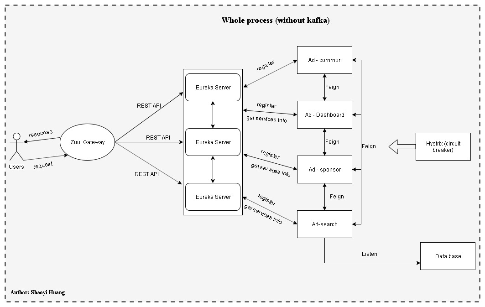
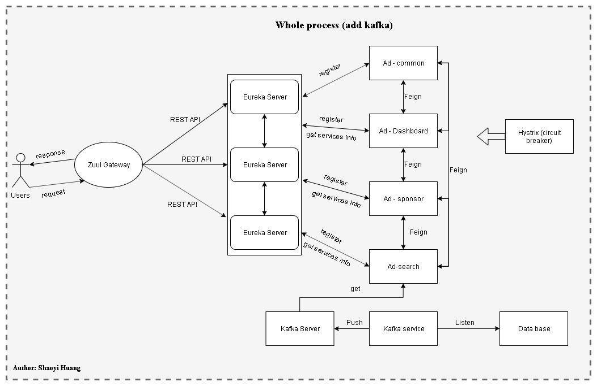
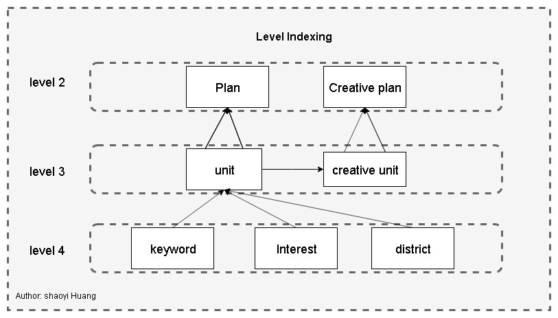
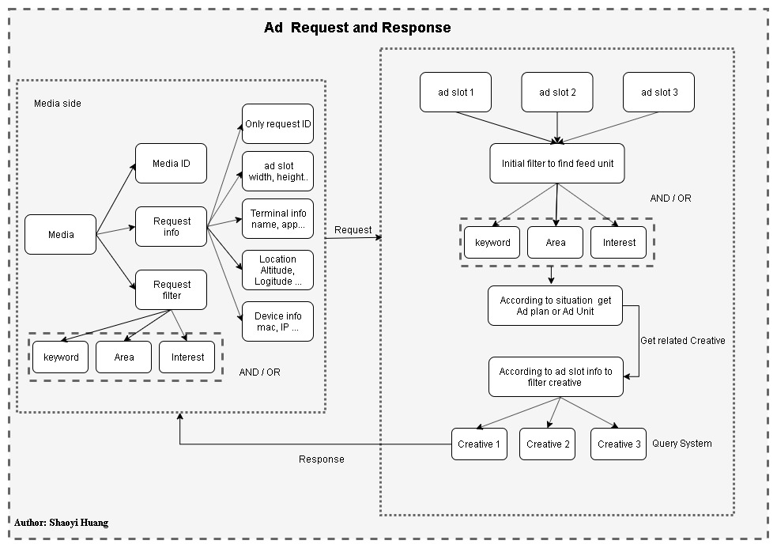

# Advertisement system

## Project Overview

The project is an backend Advertisement Indexing system developed under framework Spring-cloud. Integrated with technologies Eureka server, Restful API, Feign, Kafka and ELK tools. Used MySQL as the database. At the end, recommendation function is tested by Postman. Users can be both sponsors or customers. 

## About Contributor

Everything currently built by Shaoyi Huang

## Request and Response Process 

The whole process is go through from user sending a request to the service through REST API and firstly it will pass into zuul gateway as an Identity check and then Rest API will send to Eureka server to check the meta-info of different services. Finally request different serveries.

 

Services includes

1. Ad- common: common service part will be used by more than 1 services.
2. Ad- dashboard:  is the services shows the status of Eureka servers.
3. Ad- sponsors: sponsors MVC part about build new Ad plan or creative.
4. Ad- search: the indexing system implement the aggregation index and increment indexing for the database. The most important part of all services.

 

As the progress of the project I just want to learn more about the Message Queue Service Kafka so I Improved the backend part.

## Request and Response Process (Improved)

 

Kafka service add  between ad-search and database. One of the most important reason to add Kafka service there is that if there is more than one Ad-search service listen to the database's Binlog. The pressure for database server will be super high, so I add a message queue there that all of increment indexing will transferred to other services through the message queue. By doing so, reduced the pressure on database.

## Indexing levels for the system

Level relationship is shown above, and then query of different creative plan will be more accurate and clear based on level relationships.

 

## Request and Response with details

All of attributes information is shown above. It explains how the system get exact creative part for customers.
